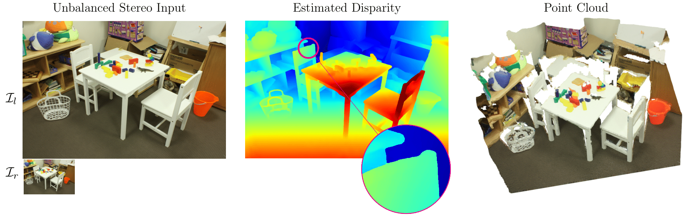

# Neural Disparity Refinement for Arbitrary Resolution Stereo
## **Best Paper Honorable Mention 3DV 2021**
### Filippo Aleotti*, Fabio Tosi*, Pierluigi Zama Ramirez*, Samuele Salti, Stefano Mattoccia, Luigi Di Stefano
#### _*Equal Contribution_
#




This repository contains a Pytorch implementation of: "Neural Disparity Refinement for Arbitrary Resolution Stereo". 3DV 2021

**Contributions:** 

* Our neural module significantly outperforms existing deep refinement approaches when processing raw disparity maps from off-the-shelf stereo matchers. Moreover, unlike other proposals, we demonstrate the ability to improve disparity maps computed by end-to-end stereo networks.

* The versatility of our architecture, which can handle any arbitrary output resolution, allows for dealing effectively with unbalanced stereo images, outperforming the accuracy of end-to-end models when deployed for this task.

* When combined with traditional stereo algorithms, our disparity refinement approach achieves superior accuracy in zero-shot generalization to unseen domains compared to state-of-the-art stereo networks without penalizing in-domain performance.

* Our novel formulation concerning the computation of output disparities yields sharp maps at depth discontinuities, which results in more accurate estimations compared to other existing output representations and clean 3D reconstructions.

For more details, please check:

[[Project Page]](https://cvlab-unibo.github.io/neural-disparity-refinement-web/)  [[Paper&Supplementary]](https://arxiv.org/pdf/2110.15367.pdf)  [[Video]](Coming Soon)


If you find this code useful in your research, please cite:

```shell
@inproceedings{aleotti2021neural,
    title={Neural Disparity Refinement for Arbitrary Resolution Stereo},
    author={Aleotti, Filippo and Tosi, Fabio and Zama Ramirez, Pierluigi and Poggi, Matteo and Salti, Samuele and Di Stefano, Luigi and Mattoccia, Stefano},
    booktitle={International Conference on 3D Vision},
    note={3DV},
    year={2021},
}
```

## Requirements
This code was tested with Python 3.8, Pytotch 1.8.1, CUDA 11.1 and Ubuntu 20.04. <br>All our experiments were performed on a single NVIDIA RTX 3090 GPU.<br>Requirements can be installed using the following script:
```shell
pip install -r requirements.txt
```
## Inference
Use the following command to refine an input noisy disparity map (rgb also required).

```shell
python apps/inference.py --load_checkpoint_path $ckpt \
                         --backbone $backbone \
                         --results_path $results_path \
                         --upsampling_factor $upsampling_factor \
                         --results_path $results_path \
                         --max_disp $max_disp \
                         --disp_scale $disp_scale \
                         --downsampling_factor $downsampling_factor \
                         --rgb $rgb \
                         --disparity $disparity
```

You can run on input images contained in the sample folder using:

```shell
bash inference.sh
```

## Pretrained models

You can download pre-trained models on our UnrealStereo4K dataset from the following links:

* [Unreal4K](https://drive.google.com/file/d/1mkc1PDE6yk1q-_DqwHRGlRvTBadJ5-En/view?usp=sharing)

* [SceneFlow](https://drive.google.com/file/d/1NAMC4uNSPwUegyCchQ0DYidBOSaCpk9W/view?usp=sharing)

## Contacts

For questions, please send an email to filippo.aleotti2@unibo.it or fabio.tosi5@unibo.it or pierluigi.zama@unibo.it

## Acknowledgements

We gratefully acknowledge the funding support of Huawei Technologies Oy (Finland).

